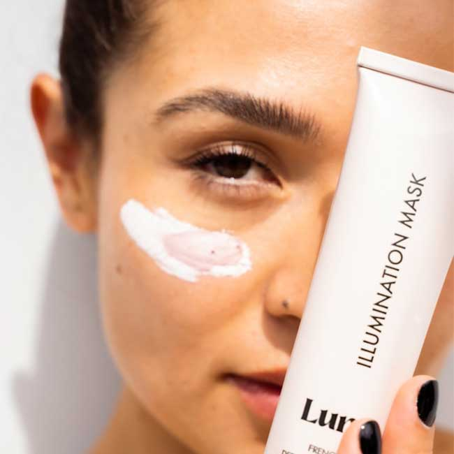

<!-- Banner / Hero Section -->
<div align="center">

## ✨ Shine Naturally with Morning Sun

Awaken your skin's natural glow every morning.  
Crafted with nature-powered ingredients to refresh and rejuvenate your complexion.



</div>

---

# codynn-care

Uma landing page moderna e responsiva para uma marca fictícia de skincare natural.  
Projeto com foco em **UI clean**, **componentização simples** e **carregamento dinâmico de cards** via JavaScript.

---

## 🚀 Tecnologias

- HTML5
- CSS3 (Flexbox & Grid)
- JavaScript (DOM / Render dinâmico)
- Google Fonts — *Inter*
- Font Awesome

---

## ✨ Funcionalidades

- Hero section com destaque de produto
- Cards dinâmicos de produtos via JavaScript
- Seções institucionais (Sobre, Produtos, Reviews)
- Newsletter com validação simples
- Layout totalmente responsivo

---

## 📁 Estrutura de Arquivos

```bash
/
├── index.html
├── estilos/
│   └── styles.css
├── script.js
└── imagens/

▶️ Como executar

Basta abrir o arquivo index.html no navegador:

open index.html


ou

start index.html  # Windows

🎥 Créditos

Projeto inspirado pela videoaula de
https://www.youtube.com/watch?v=jRHl20D9PWo

Autor do vídeo: @ManuCodingDev

📝 Licença

Código livre para estudo e aprimoramento pessoal.